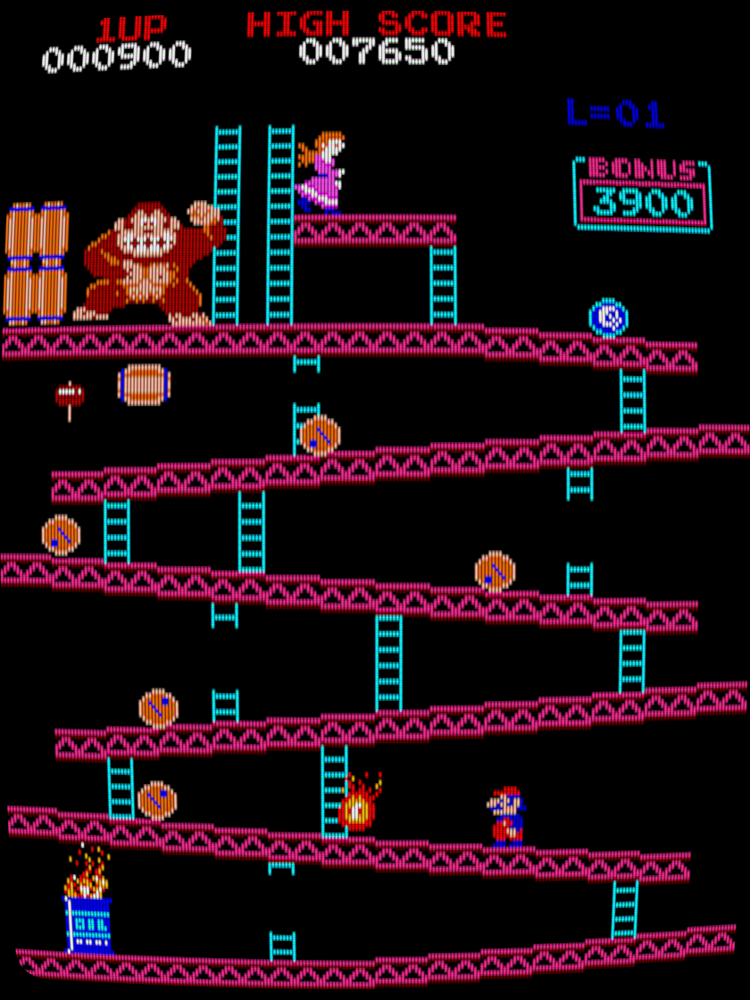
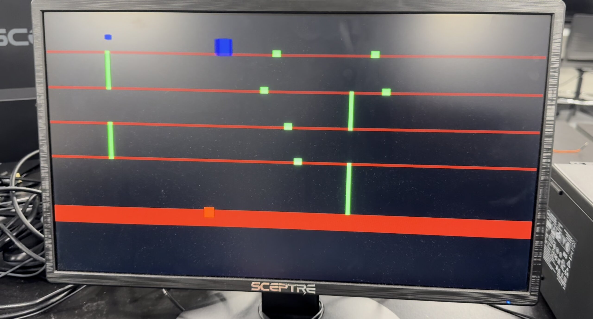
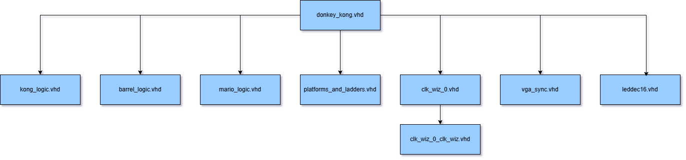
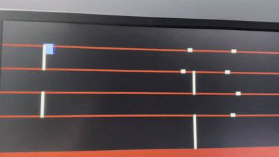

# Donkey Kong FPGA Game - CPE 487 Final Project

## Description
This project recreates the classic Donkey Kong arcade game on the **Nexys A7-100T FPGA board** using VHDL. The game is rendered on a VGA monitor and features:

- A controllable Mario character
- Moving barrels that Mario must avoid
- A randomly-placed objective (the princess) that Mario must reach to gain points
- Donkey Kong character as a hazard
- Real-time score display on the **7-segment LED display**

Here is the Donkey Kong game that was the basis for our project. We decided to try and recreate the first level, as shown below:




### Objective
The player must guide Mario to reach the objective as many times as possible while avoiding the barrels and Donkey Kong. 
- **Touching a barrel or Donkey Kong resets Mario and the score**
- **Touching the objective resets Mario's position back to the start and increases the score by 1**

### Controls
- BTNU: Mario climb up ladder
- BTND: Mario climb down ladder
- BTNL: Mario move left
- BTNR: Mario move right
- BTNC: Mario jumps

## Required Hardware
- Nexys A7-100T FPGA Board
- VGA Monitor & VGA Cable

## Images / Diagrams

#### Gameplay Screenshot



#### Module Diagram



## Steps to Run
1. **Download all VHDL and .xdc files** from this repo
2. **Create a new Vivado project** for the Nexys A7-100T
3. **Add Sources:**
   - `donkey_kong.vhd`
   - `mario_logic.vhd`
   - `kong_logic.vhd`
   - `barrel_logic.vhd`
   - `leddec16.vhd`
   - `vga_sync.vhd`
   - `platforms_and_ladders.vhd`
   - `clk_wiz_0.vhd`, `clk_wiz_0_clk_wiz.vhd`
4. **Add Constraints File:** `donkey_kong.xdc`
5. **Run Synthesis**
6. **Run Implementation**
7. **Generate Bitstream**
8. **Open Hardware Manager** and **Program the Device**

## First Build


 
## Inputs and Outputs

### donkey_kong.vhd
#### Inputs
- `clk`: System clock (100 MHz)
- `btnu`, `btnd`, `btnl`, `btnr`, `btnc`: Navigation buttons

#### Outputs
- `red`, `green`, `blue`, `hsync`, `vsync`: VGA output signals
- `led`: Debug (also mirrors score)
- `anode`, `seg`: 7-segment display outputs for real-time score
---

### mario_logic.vhd
#### Inputs
```vhdl
clk       : in STD_LOGIC;
btnu      : in STD_LOGIC;
btnd      : in STD_LOGIC;
btnl      : in STD_LOGIC;
btnr      : in STD_LOGIC;
btnc      : in STD_LOGIC;
is_ladder : in STD_LOGIC;
reset     : in STD_LOGIC;
```
- `clk`: 25 MHz pixel clock
- `btnu/btnd/btnl/btnr`: Directional controls
- `btnc`: Center button for jump
- `is_ladder`: Indicates if Mario is over a ladder
- `reset`: Triggers Mario's position reset

#### Outputs
```vhdl
x_pos     : out STD_LOGIC_VECTOR(10 downto 0);
y_pos     : out STD_LOGIC_VECTOR(10 downto 0)
```
- `x_pos`, `y_pos`: Mario's current screen coordinates

---
### kong_logic.vhd
#### Inputs
```vhdl
clk    : in STD_LOGIC;
```
- `clk`: 25 MHz pixel clock
- 
#### Outputs
```vhdl
x_pos  : out STD_LOGIC_VECTOR(10 downto 0);
y_pos  : out STD_LOGIC_VECTOR(10 downto 0);
```
- Static position of Donkey Kong on the screen

---
### barrel_logic.vhd
#### Inputs
```vhdl
clk        : in STD_LOGIC;
pixel_x    : in STD_LOGIC_VECTOR(10 downto 0);
pixel_y    : in STD_LOGIC_VECTOR(10 downto 0);
```
- `clk`: 25 MHz pixel clock
- `pixel_x`, `pixel_y`: VGA scan position for rendering

#### Outputs
```vhdl
barrel_on  : out STD_LOGIC;
x_pos0..5  : out STD_LOGIC_VECTOR(10 downto 0);
y_pos0..5  : out STD_LOGIC_VECTOR(10 downto 0);
```
- `barrel_on`: Active if barrel should be drawn
- `x_posN/y_posN`: Position of barrel N

---
### platforms_and_ladders.vhd
#### Inputs
```vhdl
pixel_x     : in STD_LOGIC_VECTOR(10 downto 0);
pixel_y     : in STD_LOGIC_VECTOR(10 downto 0);
```
- `pixel_x/pixel_y`: Current pixel position

#### Outputs
```vhdl
is_platform : out STD_LOGIC;
is_ladder   : out STD_LOGIC;
```
- Flags for whether the pixel is part of a platform or ladder

---
### leddec16.vhd
#### Inputs
```vhdl
dig  : IN STD_LOGIC_VECTOR (2 DOWNTO 0);
data : IN STD_LOGIC_VECTOR (15 DOWNTO 0);
```
- `dig`: Selects which of 4 digits to enable
- `data`: Score to display across 4 digits

#### Outputs
```vhdl
anode : OUT STD_LOGIC_VECTOR (7 DOWNTO 0);
seg   : OUT STD_LOGIC_VECTOR (6 DOWNTO 0);
```
- `anode`: Active-low anode control for each digit
- `seg`: Segment pattern for current digit

## Module Overview and Modifications

We started off with Lab 6 as the basis for this project. We reused some things such as the bat code as well as the vga_sync and leddec16 to start with the project, but changed up a lot with the bat code (used it as the basis for Mario's horizontal movement). The vga_sync (besides changing the colors to 4 bit), leddec16, and clk files are fully reused and nothing was changed to them. This project was built from scratch for the modules shown below.


***```donkey_kong.vhd```***
  ```
  process(clk_25MHz)
  begin
      if rising_edge(clk_25MHz) then
          reset <= '0';
  
          -- collision check with barrels
          for i in 0 to 5 loop
              if unsigned(mario_x) + 16 > unsigned(barrel_x_array(i)) and unsigned(mario_x) < unsigned(barrel_x_array(i)) + 12 and
                 unsigned(mario_y) + 24 > unsigned(barrel_y_array(i)) and unsigned(mario_y) < unsigned(barrel_y_array(i)) + 14 then
                  reset <= '1';
                  score <= (others => '0');
              end if;
          end loop;
  
          -- collision check with the objective
          if unsigned(mario_x) + 16 > unsigned(objective_x) and unsigned(mario_x) < unsigned(objective_x) + OBJECTIVE_WIDTH and
             unsigned(mario_y) + 24 > unsigned(OBJECTIVE_Y) and unsigned(mario_y) < unsigned(OBJECTIVE_Y) + OBJECTIVE_HEIGHT then
              reset <= '1';
              rng_counter <= rng_counter + 12345;
              objective_x <= std_logic_vector(rng_counter(10 downto 0));
              score <= score + 1;
          end if;
  
          -- collision check with donkey kong
          if unsigned(mario_x) + 16 > unsigned(kong_x) and unsigned(mario_x) < unsigned(kong_x) + 24 and
             unsigned(mario_y) + 24 > unsigned(kong_y) and unsigned(mario_y) < unsigned(kong_y) + 36 then
              reset <= '1';
              score <= (others => '0');
          end if;
      end if;
  end process;
  ```
The code above is a snippet of the top level module. The file as a whole is the main integrator for the project and instantiates all the other files. The snippet shown above is the code responsible for detecting mario's collision with barrels, the objective, and with donkey kong.

A for loop is responsible for checking all the barrles, and sees if Mario's bounding box overlaps with any of the barrel's bounding box. It checks if the bordering pixels (top, bottom, left, right) of Mario overlap with the bordering pixels of the barrels, and if so, then a reset is triggered and the score is set to zero.

The same logic is used for checking for collision with the objective and Donkey Kong, except an if statement is used since there doesn't have to be a loop for multiple objects. It checks if Mario collides with the objective, and if so, a reset is triggered. Then the **rng_counter** is used to generate a new x position for the objective, and the score is incremented by 1 since the objective was reached. The collision with Donkey Kong is simple, just checks for a collision, and if so a reset is triggered and the score is reset to zero.

***```donkey_kong.vhd```***
  ```
signal score : unsigned(15 downto 0) := (others => '0');
signal score_display : STD_LOGIC_VECTOR(15 downto 0);


if mario hits objective then
    score <= score + 1;
  ```
**signal score** is the value that counts the wins and is only incremented when Mario reaches the objective.

***```donkey_kong.vhd```***
  ```
score_display <= std_logic_vector(score);
led <= score_display;
  ```
Sends the 16 bit **score** to the Nexys board

***```donkey_kong.vhd```***
  ```
score_display_driver : leddec16
    port map (
        dig   => led_mpx,
        data  => score_display,
        anode => anode,
        seg   => seg
    );
  ```
Connects the **leddec16** to the current score. The **leddec16** handles the display logic.

### mario_logic.vhd

This was built from scratch and is the way to control Mario.

***```mario_logic.vhd```***
  ```
constant MARIO_WIDTH  : integer := 16;
constant MARIO_HEIGHT : integer := 24;
constant JUMP_FORCE   : integer := 9;
constant GROUND_Y     : integer := 435;

signal x : std_logic_vector(10 downto 0) := conv_std_logic_vector(60, 11);
signal y : std_logic_vector(10 downto 0) := conv_std_logic_vector(GROUND_Y, 11);
signal jumping : boolean := false;
signal jump_height : integer := 0;
signal y_dir : integer := 0; -- -1 = up, 1 = down, 0 = idle


constant platform_levels : platform_array := (75, 155, 235, 315, 395, 435);
  ```
Mario is 16x24 pixles in size. **jumping** is the flag for the jump state and **platform_levels** defines the Y coordinates of the platforms for snapping.

***```mario_logic.vhd```***
  ```
if btnr = '1' and x_int < 640 - MARIO_WIDTH then
    x <= x + 4;
elsif btnl = '1' and x_int > 0 then
    x <= x - 4;
end if;
  ```
This moves Mario left and right. btnL and btnR when = 1 allows Mario to move and his x position is adjusted by updating the position which moves Mario by 4 pixels per frame.

***```mario_logic.vhd```***
  ```
if y_dir = -1 then
    y_int := y_int - 4;
    jump_height <= jump_height + 4;
    if jump_height >= JUMP_FORCE * 4 then
        y_dir <= 1; -- begin falling
    end if;
  ```
Mario rises by 4 pixels per frame until the jump height is = 36. 

***```mario_logic.vhd```***
  ```
elsif y_dir = 1 then
    y_int := y_int + 4;

    for i in 0 to 5 loop
        if (y_int + MARIO_HEIGHT >= platform_levels(i)) and (y_int + MARIO_HEIGHT - 4 < platform_levels(i)) then
            y_int := platform_levels(i) - MARIO_HEIGHT;
            jumping <= false;
            y_dir <= 0;
        end if;
    end loop;

    if y_int + MARIO_HEIGHT >= GROUND_Y then
        y_int := GROUND_Y - MARIO_HEIGHT;
        jumping <= false;
        y_dir <= 0;
    end if;
  ```
Checks to see if Mario's feet are about to just touch a platofrm, and if so, he snaps to the top of that plaform and stops falling.

***```mario_logic.vhd```***
  ```
if touching_ladder then
    if btnu = '1' then
        y_int := y_int - 4;
        jumping <= false;
        y_dir <= 0;
    elsif btnd = '1' then
        y_int := y_int + 4;
        jumping <= false;
        y_dir <= 0;
    end if;
  ```
If Mario's within a ladder hitbox then he can move vertical using btnu and btnd. Ladder climbing overrides jumping logic, allowing vertical control to go up or down.

***```mario_logic.vhd```***
  ```
for i in 0 to 5 loop
    if (y_int + MARIO_HEIGHT) >= platform_levels(i) and (y_int + MARIO_HEIGHT) <= platform_levels(i) + 1 then
        y_int := platform_levels(i) - MARIO_HEIGHT;
    end if;
end loop;
  ```
Mario won't really float above platforms and makes sure that he lands cleanly after climbing.

### Barrel Logic

***```barrel_logic.vhd```***
  ```
if reset = '1' then
    x <= conv_std_logic_vector(60, 11);
    y <= conv_std_logic_vector(GROUND_Y, 11);
    jumping <= false;
    y_dir <= 0;
    jump_height <= 0;
  ```
This is the reset for Mario's position whenever he dies or reaches the objective. Moves his position back to the start.

***```barrel_logic.vhd```***
  ```
barrels(i).counter <= barrels(i).counter + 1;
if barrels(i).counter = to_unsigned(1000000, 20) then
    barrels(i).counter <= (others => '0');
  ```
Movement is time controlled using an internal counter for each barrel, ensuring they only move once per 1 million clock cycles, then movement is applied

***```barrel_logic.vhd```***
  ```
if barrels(i).dir = '1' then
    if unsigned(barrels(i).x) < 628 then
        barrels(i).x <= std_logic_vector(unsigned(barrels(i).x) + 1);
    else
        barrels(i).dir <= '0'; -- Hit edge, switch direction
    end if;

else
    if unsigned(barrels(i).x) > 1 then
        barrels(i).x <= std_logic_vector(unsigned(barrels(i).x) - 1);
    else
        barrels(i).dir <= '1'; -- Hit edge, switch direction
    end if;
end if;
  ```
Direction flips whenever the barrel hits either boundary (left or right of the screen)

### Platforms and Ladders

***```platforms_and_ladders.vhd```***
```
if (pixel_y >= 80 and pixel_y <= 85) then
    is_platform <= '1'; 
elsif (pixel_y >= 160 and pixel_y <= 165) then
    is_platform <= '1'; 
elsif (pixel_y >= 240 and pixel_y <= 245) then
    is_platform <= '1';
elsif (pixel_y >= 320 and pixel_y <= 325) then
    is_platform <= '1';
elsif (pixel_y >= 440 and pixel_y <= 479) then
    is_platform <= '1';
end if;
  ```
Each of the if and elsif statements correspond to a horizontal bar a t a fixed y position, and this is the solid ground per each level that Mario climbs. 

***```platforms_and_ladders.vhd```***
```
process(pixel_x, pixel_y)
begin
    is_platform <= '0';
    is_ladder   <= '0';
  ```
Default values are '0' so theres no ladder or platform unless proven otherwise.

***```platforms_and_ladders.vhd```***
```
if (pixel_x >= 100 and pixel_x <= 105) and (pixel_y >= 80 and pixel_y <= 165) then
    is_ladder <= '1';
elsif (pixel_x >= 500 and pixel_x <= 505) and (pixel_y >= 160 and pixel_y <= 245) then
    is_ladder <= '1';
elsif (pixel_x >= 100 and pixel_x <= 105) and (pixel_y >= 240 and pixel_y <= 325) then
    is_ladder <= '1';
elsif (pixel_x >= 500 and pixel_x <= 505) and (pixel_y >= 320 and pixel_y <= 440) then
    is_ladder <= '1';
end if;
  ```
Each if and elsif statement represents a zone of ladders, which is a vertical block of pixels that allows Mario to climb. x and y must be within bounds and the ladders are 6 pixels wide. This is how Mario traverses the platforms.

### Kong

***```kong_logic.vhd```***
  ```
process(clk)
begin
    if rising_edge(clk) then
        counter <= counter + 1;
  ```
Counter increments each frame, when it reaches 1,000,000 DK moves.

***```kong_logic.vhd```***
```
if dir = '1' then
    if x < to_unsigned(620, 11) then
        x <= x + 4;
    else
        dir <= '0';
    end if;
else
    if x > to_unsigned(10, 11) then
        x <= x - 4;
    else
        dir <= '1';
    end if;
end if;
  ```
DK moves right if he's not at an edge (x+4) and when he reaches x = 620 he moves left.

# Gameplay


Gameplay shown above.


Scoring working as shown above.

## Summary and Contributions
Ashish - I worked on building the buillding the collision logic which includes mario climbing up and down the ladders, the scoring logic and built the mario_logic.vhd file, and platforms_and_ladders.vhd. I also had possession of the board and made minor changes and improvements to the game.

Yazen - I worked on building the kong_logic.vhd, barrel_logic, helped with the collision logic, and the objective randomness (although it was not true random, the location changes are the same for each run of the game). I also helped with making some quality of life changes like making the platform colors a little darker than Mario by making the colors in vga_sync.vhd 4 bits.

### Timeline
- Week of 4/21 - Brainstorming ideas and writing down the structure the game would follow
- Week of 4/28 - Started to work on the game by taking components of the Pong lab, and started to build the platforms and ladders file
- Week of 5/05 - started to reverse-engineer pong.vhd, and bat_n_ball.vhd from lab 6 and build the kong_logic, barrel_logic, and some part of mario_logic. The following weekend, we worked on building the collision logic and how work with mario climbing ladders, and put all the components in the top file: donkey_kong.vhd.

### Challenges faced and how we would fix them if given more time
For starters, we had issues with the Mario jumping mechanic, where he wouldnt jump back down. Initially, our approach was to add a gravity constant that way he will come back down after he jumps, but there were complications as he would keep falling. We fixed this by removing the gravity constant all-together and implemented a logic where his velocity changes after he went a number of pixels off the ground, which was 9. Another challenge that we faced was whenever Mario climbs up a ladder, he would not snap on to the next platform, but we were able to fix this by adding a small overhead, but in return we had to sacrifice how the game looks. Mario looks like he would be floating, but it made the game a little more playable. In the game there was another bug, when mario climbs up a ladder all the way and move to the right or left, he wouldn't be able to climb down the ladder unless he jumps, which brings him closer to the ground. The jump would being him back to 4 pixels above the groud (again we added invisible pixel logic so mario can climb down the ladder). If given more time, we would try a more robust logic that way mario would actually be touching the platforms when moving around, and also try to add sprites to make the game as close to the original as possible.

